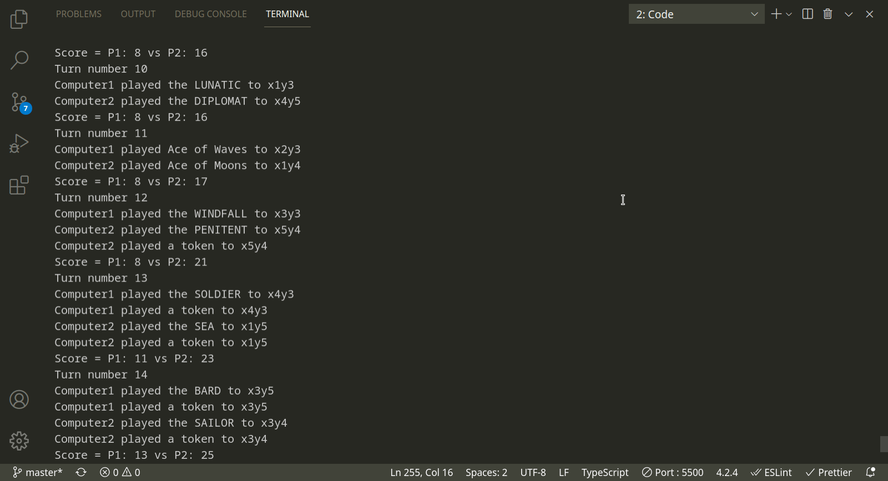

# Creating a Digital Adaptation of a Board Game in TypeScript

As my first project not related to any curriculum I decided to create an implementation of the card game [Jacynth](http://wiki.decktet.com/game:jacynth) from the [Decktet](https://www.decktet.com/). I built the app using TypeScript, with an Express.js server and Socket.io for real time multi-player. I took some notes during development and have included some of the more interesting questions that arose here. Let's begin!

Jacynth is an area control card game played using the [Decktet](https://www.decktet.com/), a unique deck of cards designed and beautifully illustrated by PD Magnus, and shared for free under a Creative Commons license. The Decktet was my first introduction to the board game hobby, and a couple Decktet games playable still count among my favorites. (In the interest of making a design that would work well on small screens I didn't use the original cards and made the cards into tiles instead.)

## The User Interface

### Drag and Drop

I wanted to create a mobile first design, and I knew that drag and drop would be essential considering the nature of the game. The [MDN](https://developer.mozilla.org/en-US/docs/Web/API/HTML_Drag_and_Drop_API) page on drag and drop contains all that's needed to get started, but unfortunately HTML5 drag and drop is not yet supported on many mobile browsers. Luckily someone has created a [polyfill](https://github.com/Bernardo-Castilho/dragdroptouch) that solves this problem!

### A responsive design

There are a lot of ways to handle how to adapt to different device sizes. In this case the main element of the interface is the game board. I decided to set the game board size based on the available screen size.

``` css
--gameboard-width: min(60vh, 100vw);
```

On pretty much any device which has a 'portrait' type screen, the width will be the limiting factor to the size of the board. If the window is closer to a square for some reason, it's possible that the other elements of the GUI could get cut off, so I used `min` to make sure the game board also doesn't take up more than 60% of the screen height.

``` CSS
--desktop-gameboard-width: min(90vh, 49vw);
```

On a landscape type screen, height will be the limiting factor. I used media queries to change the `gameboard-width` property to our desktop version if our screen has landscape orientation.

``` CSS
@media (orientation: landscape) {
  :root {
    --gameboard-width: var(--desktop-gameboard-width);
  }
```

 The `gameboard-width` property also acts as a perfect responsive unit of measurement for elements on the page:

``` CSS
--border-radius: calc(var(--gameboard-width) / 70);
--border-width: calc(var(--gameboard-width) / 200);
--text-large: calc(var(--gameboard-width) / 20);
```

### Working with CSS Grid

CSS grid makes working in two dimensions easy. [This](https://grid.malven.co/) reference sheet is super handy! There was one hitch though: I wanted the grid elements to be in a slightly different order on landscape vs portrait devices. [CSS gris template areas](https://developer.mozilla.org/en-US/docs/Web/CSS/grid-template-areas) to the rescue. With CSS grid template areas you can define (or redefine) exactly how different grid elements should be displayed.

``` CSS
.main-grid {
/*other CSS */
  grid-template-areas:
    'menuBar'
    'enemyHUD'
    'gameboard'
    'playerHUD'
    'playerHandContainer';
}

@media (orientation: landscape) {
  :root {
    --gameboard-width: var(--desktop-gameboard-width);
  }

  .main-grid {
    grid-template-columns: auto auto;
    grid-template-areas:
      'menuBar menuBar gameboard'
      'enemyHUD playerHUD gameboard'
      'playerHandContainer playerHandContainer gameboard'
      '. . gameboard'
      '. . gameboard'
      '. . gameboard'
      '. . gameboard'
      '. . gameboard';
  }
```

## Coding the logic


### The game board

Initially I started with a 2d array. But I realized that I can get the benefits of a 2d array by using xy coordinates as the ID in a JavaScript  `Map()` , but that it would be much simpler to iterate over.

### Finding a connected District

A district is any contiguous collection of cards which share the same suit. Recursion was an obvious choice for this problem. Initially I ran into an issue with the nested iterations losing context, but it was easily solved by refactoring to an arrow function.

``` typescript
  getDistrict(spaceID: string, suit: Suit): BoardSpace[] {
    const results = [] as BoardSpace[];
    const currentSpace = this.getSpace(spaceID);
    if (!currentSpace) return results;
    const currentCard = currentSpace.getCard();
    if (!currentCard || !currentCard.hasSuit(suit)) return results;

    results.push(currentSpace);

    const searchConnectedTiles = (spaceID: string, suit: Suit) => {
      this.getAdjacentSpaces(spaceID).forEach((space) => {
        if (!results.includes(space)) {
          const card = space.getCard();
          if (card) {
            if (card.getAllSuits().includes(suit)) {
              results.push(space);
              searchConnectedTiles(space.getID(), suit);
            }
          }
        }
      });
    };
    searchConnectedTiles(spaceID, suit);
    return results;
  }
```

### Adding type safety with TypeScript

Not too long ago I participated in a peer led TypeScript seminar using the book [TypeScript in 50 lessons](https://typescript-book.com/). I was impressed by the features it added to JavaScript while still seeming to offer more flexible than Java (my frame of reference for a statically typed language.)  

I initially didn't intend to use Typescript for this project, but while writing the methods for the game board class I was starting to feel like TypeScripts type hints would be really handy. I decided to convert the project to Typescript. Overall it was pretty easy,  although I had to do some configuration to get prettier and ESlint to play nice together with TypeScript. [This](https://khalilstemmler.com/blogs/tooling/prettier/) guide was very helpful for that.

There wasn't really any tricky Typescript cases in this project, but it was nice to get my hands dirty with TypeScript and I look forward to diving deeper with it in the future.

### Coding the AI

This was probably the most fun part of this project. Each turn the AI needs to choose which of the 3 cards in hand to play, and choose whether or not to place an influence token. I decided to use a [greedy algorithm](https://en.wikipedia.org/wiki/Greedy_algorithm) with the main goal of just finding whatever move increases the score the most in this turn. Since there are only 4 tokens to place during the entire game however, I also set a minimum threshold of score for when to place a token. The method of choosing a move is:

For placing a card:

- The highest increase in score possible (including a decrease to the other players score by stealing territory)

For placing an influence token:

- First check whether minimum requirements are met, then choose the option which results in the highest increase in score, followed by choosing the highest ranking card available.

Pretty much the ideal rank to place a token is a 9: it is the highest ranked card that still has 2 suits (the crowns only have 1 suit.) But if we tell the AI to only place tokens on 9 rank cards, it might never get a chance to place all it's tokens.

A good minimum threshold for placing a token for each related factor might be:

- Card rank: 6 or higher
- Total connected territory (IE increase in score): 4 or higher

As the game progresses however we need to get less picky. We'll use the number of empty spaces on the board as a percentage of the whole to create a function that we can use to dynamically adjust the threshold for both card rank and territory.

``` typeScript
  private adjustMinThreshold(hopedForAmt: number) {
    const spaceLeft = this.gameBoard.getRemainingSpacesNumber();
    const sizeOfTheBoard = Math.pow(this.gameBoard.getBoardSize(), 2);
    const settledForNumber = Math.ceil(
      hopedForAmt * (spaceLeft / sizeOfTheBoard)
    );

    return settledForNumber;
  }
```

As the game progresses, whatever number is passed to the function as input will eventually lower to 1.

#### Making a choice

There are a large number of potential choices to sort through.

``` Number of cards in hand * number of available spaces to place a card * number of available spaces to place a token ```

The process will be:

1.  For each card, get the score for every possible placement. Sort for the highest score.
2.  For each possible influence token location which meets the minimum value requirement, get the score. Sort for the highest score.
3.  If the highest scoring influence token placement is at least 4 points higher than the highest score from only placing a card, place an influence token.

For each of these choice, the card and influence token will need to be added to the board and then the board will be scored. After the score is taken, the card and influence token should be removed and the score reset.

In order to explore all the available options, the AI needs to be able to add cards and markers to the board, check the score, remove them, and move on to the next option. This meant refactoring some of my previous methods to be more modular.

#### A working AI!



I got the AI up and running and was excited to see it looked like it was working fairly well. I found that the threshold for placing a token was too high, leading to whichever player happens to get the luck to place a token first always winning. I reduced the threshold and things seemed to even out.

#### A very helpful opponent

What I didn't realize from looking at the command line, was that each AI was making the play that is the most beneficial to *it's opponent!* I realized it later when the GUI was finished. Luckily it was an easy fix: I was just sorting the AI move choices resulting array in ascending order rather than descending.

## The Model View Controller design pattern

Fairly quickly I decided that there was enough code involved in this project to warrant adopting a more structured software design pattern. I opted for the model view controller pattern which I've worked with before in Java. I found an excellent tutorial on implementing the MVC pattern in a JS based webapp [here](https://www.taniarascia.com/javascript-mvc-todo-app/).

Once model and view methods are complete, they are connected together in the controller. For example, when a player drags a tile on to the board via methods defined in the view, that needs to get updated in the model. Here's the play card method in the model:

``` typescript
  playCard = (spaceID: string, cardID: string) => {
    const card = this.getCardFromHandByID(cardID);
    if (!card) return false;
    if (!this.gameBoard.setCard(spaceID, card)) {
      return false;
    } else {
      this.hand = this.hand.filter((ele) => ele !== card);
      return true;
    }
  };
```

The view needs to be able to invoke this method. 

The introductory guide to MVC in Javascript I referenced [here](https://www.taniarascia.com/javascript-mvc-todo-app/) makes use of an intermediary method on the controller class used to bind the model and view:

``` typescript
handleSendCardPlayToModel(cardID: string, spaceID: string) {
    this.model.playCard(cardID, spaceID);
}
```

And then bind this in the view like this:

``` typescript
bindSendCardPlayToModel(
    sendCardPlayToModelCB: (cardID: string, spaceID: string) => boolean
  ) {
    this.sendCardPlayToModel = sendCardPlayToModelCB;
  }
```

Perhaps the author is working from an existing design pattern, or perhaps in larger software there is a justification for this that I am missing. But it seems to me that this just creates an extra method on the controller without leading to any greater separation between the model and the view, since we still have to expose the callback methods publicly on their originating classes.

It makes sense to me to just pass the model method directly into the `bind` function of the model from within the controller:

``` typescript
this.view.bindSendCardPlayToModel(this.model.player1.playCard);
```

### Single-player mode complete!

And with that the single-player mode is complete! I regularly score 5-10 points above the AI, so it's certainly not competitive, but not too shabby. Perhaps I will improve it in the future.

## Multi-player with Socket.io

I decided to make the game multi-player and after reading up on Socket.io it's usage seems fairly straight forward. The greatest obstacle was synchronizing the state of the board and deck for both players. The entire game was originally client side. This synchronization necessitated moving some functionality to the server. There were really only two main functions that needed to be moved - the deck, and the function that lays out the initial board at the start of the game. In addition to this, the methods related to updating the model and view needed to be modified to work with Socket.io. An obvious solution was to extend the main classes with `singlePlayer` and `multiPlayer` variants.

### The deck should be handled on the server, but cards cannot be JSONified?

The server should be responsible for dealing cards to players so as to ensure consistency in what the players recieve. But cards can't be JSONified since they have setter and getter methods. The solution is for the server to transmit a card ID, which the client will use to find the card from it's own local copy of the deck.

``` typescript
 // server side
const deck = new Decktet('basicDeck');

socket.on('drawCard', (playerID: 'Player1' | 'Player2') => {
    console.log('drawCard called');
    const card = roomsGameData[currRoomNo].cardDeck?.drawCard();
    if (!card) return;
    io.to(roomID).emit('recieveCardDraw', card.getId(), playerID);
  });
 
// client side
socket.on('recieveCardDraw', (cardID: string | undefined, playerID: string) => {
    if (playerID !== this.playerID || !cardID) return;
    const card = this.deck.getCardByID(cardID); // get card by ID from the local deck.
    if (card) this.hand.push(card);
    console.log(
      'cardDraw, cardID, playerID, handArr',
      card?.getId(),
      this.playerID,
      this.hand
    );
    if (!card || !this.sendCardDrawtoView) return; // if sendCardDrawToView callback has been provided, use it.
    this.sendCardDrawtoView(card);
  });

// the getCardByID method on the local card deck class
  getCardByID(cardID: string): Card | undefined {
    return this.cards.filter((card) => card.getId() === cardID)[0];
  }
```

I debated whether it was worth converting the deck from an array to an ES6 map in order to allow direct access to each card rather than having to search the array, but concluded that with 36 cards in a normal deck, and a single search by id only resulting in O(N) time complexity, it's not an issue.

There is some other interesting code on the client side here as well. Since we want each client to keep a copy of the cards in hand for both player 1 and player 2, we send every card draw to each connected client. We use the Player ID to know whether or not the current instance of the `Player` class should accept the card or ignore it. 

The next question is, should the card draw be sent to the view? This is actually an easy one. When creating the opponents Player class on the client machine, we just don't provide it the callback to send a card to the view. Problem solved!

### Matching players

We need to be able to match players, ensure that we get 2 players in each game, and that we don't try and add a 2nd player to an existing table that actually has an opening because one of the original players dropped.

Each room will have an object to hold related data:

``` typescript
type roomDataObject = {
  roomName: string;
  layoutSpaces: string[] | undefined;
  layoutCards: Card[];
  p1Connected: boolean;
  p1ready: boolean;
  p2Connected: boolean;
  p2ready: boolean;
  cardDeck: Decktet | undefined;
};
```

and we will create an array of these objects, one for each game table.

``` typescript
const roomsGameData = [] as roomDataObject[];
```

Then, whenever a user connects, we start from room #0 and keep looking until we find an open room.

``` typescript
io.on('connection', (socket) => {
  console.log('a user connected');

  let currRoomNo = 0;
  let foundRoom = false;
  let room = io.sockets.adapter.rooms.get(`room-${currRoomNo}`);

  while (!foundRoom) {
    room = io.sockets.adapter.rooms.get(`room-${currRoomNo}`);
    // go to next room if current room is full.
    if (room && room.size === 2) {
      currRoomNo++;
      // if room already has 1 player: check if the game already started.
      // if so, go to next room. otherwise join as player 2.
    } else if (
      room &&
      room.size === 1 &&
      roomsGameData[currRoomNo] &&
      roomsGameData[currRoomNo].p2ready == true
    ) {
      currRoomNo++;
    } else {
      // otherwise, the room is empty, or only has 1 player & has not been started.
      // we can join the room.
      foundRoom = true;
    }
  }
```

## Main take-aways

In addition to getting some more practice with Typescript, the MVC pattern, and exposure to Socket.io, my main take-aways from this project were to reinforce things I have already learned throughout my journey with software development so far. One is to try to write code as documentation, by using variable and method names that make it easy to see what is happening in your code. The other is that if you find yourself doing something more than once, it might be worth making a method for that!

Thanks for reading!
